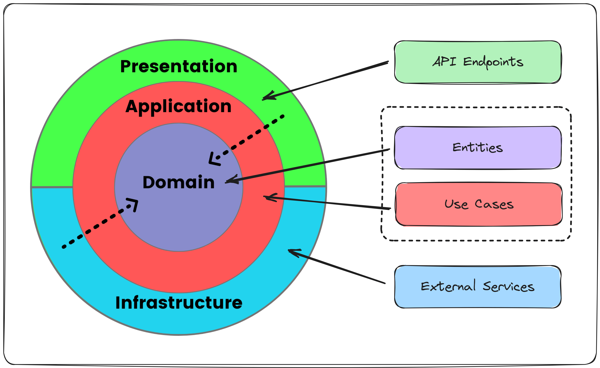

## Clean Architecture
A starter template for Clean Architecture solution in ASP.NET Core. It uses Domain Driven Design techinques to model the domain.

Clean Architecture is a different take on the N-Layer architecture with a focus on decoupling and dependency inversion.  
It pays off when you have complex business logic than for solutions that are more CRUD based.

Image Credit [https://twitter.com/mjovanovictech/status/1719700976649572701]
 
 

Main advantages of Clean Architecture are
1. Business Logic encapsulated into the Domain model
2. Applicatoin layers takes care of orcestration and workflows
3. Domain Layer has no dependency on Data Layer
4. Better testability
5. Fits closely with Domain Driven Design

#### Domain Layer
- Domain layer captures business rules.
- Uses tactical design techniques from DDD to design
  - **Entities** : Objects that can be identified using an ID
  - **ValueObjects** : No sparate identity, if the values are same, then they are the same.
  - **Aggregates** : This defines the transaction boundary. It is a group of entities and value objects. The aggregate has a root entities which is the means of commnucating with outside. Aggregate root is suppose to ensure the invariance and consistancy with in the aggregate. Do not create big aggregates, it will affect the performance of the system.
  - **Services** : Domain services captures rules that does not fit into a entity or aggregate. For eg, rules that span across aggregates.
  - **Events** : Invariances across aggregates are ensured using events and event handlers. The changes across aggregates are guaranteed to be consistant eventually.
- Domain models desinged as solution to the problem statement, not based on how the data will be stored. Data persistance should follow the model as it evovles.
- Avoid Anemic classes. Use good old object oriented techniques like abstraction, encapsulation etc to create rich model.

#### Application Layer
- Orchestrates the interaction within domain model to capture business use cases
- Implements CQS (Command Query Segragation) pattern
- Command operations makes use of the domain model enforcing the aggregate invariants,  while query operations are done directly without the overheads of the domain models.

#### Presentation Layer
- Web API layer using ASP.NET Core minimal API
- Uses the application layer to execute business use cases
- No business logic in this layer, focus on web server concerns like HTTP request/response, routing etc.

#### Infrastructure Layer
- This layer takes care of interfacing with external systems, like database, external APIs, message queues, storage etc.
- Entityframework Core used as ORM tool. Code first migration to generate the database from code.
- Entityframework Core features allows us to keep the ORM mapping and configuration separate form the entity model, allowing the flexibility to model the entities based on the business concerns rather than focuing on database mapping.
